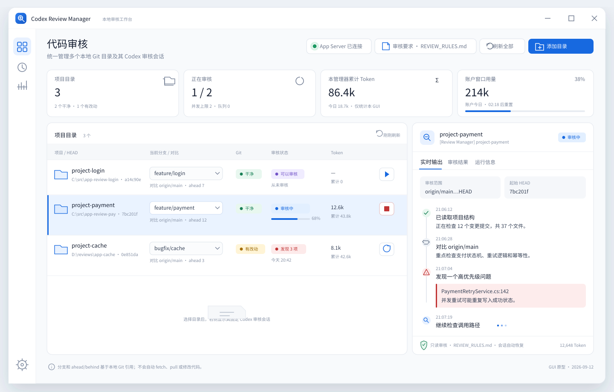

# Codex 多目录代码审核管理器

完整落地实施文档

- 文档版本：1.3
- 编写日期：2026-09-12
- 目标平台：Windows 优先，兼容 macOS / Linux
- 推荐技术栈：Electron + React + TypeScript + SQLite
- 集成方式：Codex App Server，JSON-RPC over stdio
- 状态：可直接用于实施

---

## 0. 先说清楚这句话的准确含义

> GUI 自己管理 Codex 会话、状态、Token：官方支持，稳定。

这里的“自己管理”不是让你手工维护会话，也不是让 GUI 操纵 Codex 客户端左侧聊天栏。

准确含义是：

1. GUI 在后台自动启动 <code>codex app-server</code>。
2. GUI 通过官方 App Server 协议创建、恢复和执行 Codex thread。
3. 每个项目目录自动绑定一个固定 thread。
4. thread ID、turn ID、状态恢复和 Token 累计全部由 GUI 保存，用户不需要看到或维护。
5. 点击“开始审核”后，GUI 自动调用 <code>thread/resume</code> 或 <code>thread/start</code>，再调用 <code>review/start</code>。
6. Codex 的流式输出、审核完成状态和 Token 事件实时显示在 GUI 中。

这套方案使用 Codex 官方 App Server 接口，是本文的正式方案。

但以下能力目前不能写成官方保证：

- GUI 创建的 thread 一定出现在 Codex 桌面客户端左侧聊天栏。
- GUI 可以稳定找到并接管桌面客户端当前打开的任意聊天。
- GUI 写入消息后，桌面客户端左侧同一会话一定实时刷新。
- 桌面客户端和外部 GUI 可以同时操作同一 thread，且不会产生竞争或状态不一致。

因此，本文把“左侧聊天栏同步”定义为可选兼容性实验。实验成功可以启用；实验失败不影响正式功能。

---

## 1. 交给 Codex 开始实施时使用的总指令

将下面内容连同本文件一起交给 Codex：

~~~text
请完整阅读本文件，并在当前工作区实现 Codex 多目录代码审核管理器。

实施规则：

1. 严格按 Phase 0A、Phase 0B、Phase 1、Phase 2、Phase 3、Phase 4 的顺序执行。
2. 先完成 Phase 0A 官方 App Server 探针；只有探针通过后才进入正式开发。
3. Phase 0B 左侧聊天栏互通只是兼容性实验。失败时记录结果并关闭该功能，不得阻塞正式架构。
4. 不得宣称左侧聊天栏同步是官方保证。
5. App Server 只使用 stdio，不开放本地 TCP 或 WebSocket 端口。
6. 每次构建都根据本机 Codex 版本重新生成 App Server TypeScript schema；不要手写或猜测协议字段。
7. Git 命令必须使用参数数组并指定 cwd，不得拼接 shell 命令字符串。
8. 默认审核必须使用只读 sandbox。
9. 不得自动 force checkout、reset、clean、stash、pull、push 或删除分支。
10. 保留用户已有文件和改动，不修改任务无关内容。
11. 每完成一个 Phase，运行相应测试并提交一份验证结果。
12. 遇到协议字段与本文示例不一致时，以本机生成的 schema 和官方文档为准，并更新兼容层与文档。
13. 所有审核必须加载用户选择的全局默认审核要求文档；不得以内置通用提示替代。
14. 选择或手动重新读取要求文档时保存规范化内容；每次审核把这份已保存内容、路径、SHA-256 和读取时间快照到 review run，不自动重新读取源文件。
15. 要求文档未配置时必须阻止审核；选择或手动重新读取时遇到丢失、为空、超限或无法读取，必须保留上一份成功内容并给出明确错误。
16. 即使复用已有 thread，也必须在每次审核中重新附带完整要求，不能依赖 thread 的历史记忆。

先输出：

- 当前环境检查结果；
- Phase 0A 的实施计划；
- 预计创建的文件；
- 需要我手工配合的步骤。

然后开始实施，不要先生成空壳项目后跳过验证。
~~~

---

## 2. 产品目标

### 2.1 核心场景

同一个 Git 仓库被 checkout、clone 或 worktree 到多个独立目录，每个目录用于切换或审核不同分支。用户希望在一个 GUI 中：

- 添加和管理多个本地 Git 目录。
- 查看每个目录的当前分支、HEAD、工作区状态及审核状态。
- 在安全条件满足时切换分支。
- 为每个目录自动创建并复用一个 Codex 审核会话。
- 一键开始、停止、重新运行代码审核。
- 由用户选择一份全局默认审核要求文档，并强制应用到所有审核。
- 实时查看 Codex 输出。
- 查看单次审核、单目录、GUI 管理范围及账户范围的 Token 数据。
- 关闭并重新打开 GUI 后自动恢复目录和会话关系。
- 不需要用户直接使用 Codex CLI 界面，也不需要保存 thread ID。

### 2.2 用户体验目标

用户的日常流程应当只有：

1. 首次选择全局默认审核要求文档。
2. 首次添加目录。
3. 选择当前分支和对比分支。
4. 点击“开始审核”。
5. 查看流式输出和最终结果。
6. 必要时点击“停止”或“重新审核”。

其余工作由 GUI 自动完成。

### 2.3 非目标

首版不做以下事情：

- 不替代完整 Git GUI。
- 不执行 merge、rebase、cherry-pick、push、force checkout 或自动修复冲突。
- 不自动修改被审核代码。
- 不在缺少用户审核要求文档时使用内置默认规则静默继续。
- 不把多个工作目录折叠为一个共享会话。
- 不依赖 Codex 桌面客户端左侧聊天栏作为数据源。
- 不把账户 Token 总量错误地当作本 GUI 的 Token 消耗。
- 不向公网或局域网暴露 App Server。

---

## 3. 支持边界

| 能力 | 实现方式 | 正式支持状态 |
|---|---|---|
| GUI 启动 Codex | 后台启动 <code>codex app-server</code> | 正式方案 |
| 每目录一个会话 | GUI 自动创建、恢复、映射 thread | 正式方案 |
| 全局默认审核要求 | 选择或手动重新读取时保存内容，每次运行复制为快照 | 正式方案，强制 |
| 点击开始自动输入任务 | GUI 调用 <code>review/start</code> 或 <code>turn/start</code> | 正式方案 |
| 流式显示回复 | 监听 item 和 turn 事件 | 正式方案 |
| 显示审核运行状态 | 监听 thread、turn、review 事件 | 正式方案 |
| 停止审核 | 调用 <code>turn/interrupt</code> | 正式方案 |
| 显示 thread Token | 监听 <code>thread/tokenUsage/updated</code> | 正式方案 |
| 显示账户使用量 | 调用 <code>account/usage/read</code> | 取决于认证类型 |
| 显示速率限制 | 调用 <code>account/rateLimits/read</code> | 正式方案 |
| GUI thread 出现在桌面左栏 | 未作为 App Server 契约保证 | 兼容性实验 |
| 接管桌面左栏已有聊天 | 可探测，不作为正式依赖 | 兼容性实验 |
| 两个客户端同时操作同一 thread | 存在竞争风险 | 默认禁止 |

---

## 4. 总体架构

~~~mermaid
flowchart TB
    UI["Electron Renderer 目录、分支、审核、Token"] --> IPC["Typed IPC"]
    IPC --> Core["Electron Main 调度与状态机"]
    Core --> Git["Git Service 每条命令指定 cwd"]
    Core --> Sessions["Session Registry 目录到 thread 映射"]
    Core --> Reviews["Review Service 队列、开始、停止、恢复"]
    Core --> Tokens["Token Service 快照与累计"]
    Sessions --> RPC["App Server Client JSON-RPC over stdio"]
    Reviews --> RPC
    Tokens --> RPC
    RPC --> Codex["codex app-server"]
    Core --> DB["SQLite 配置、会话、审核记录"]
~~~

### 4.1 进程划分

#### Electron 主进程

负责所有高权限操作：

- 启动、监控和重启 App Server 子进程。
- 读写 SQLite。
- 执行 Git 命令。
- 保存目录与 thread 映射。
- 调度审核队列。
- 聚合 Token。
- 向渲染进程发送经过校验的事件。

#### Electron 渲染进程

只负责界面：

- 展示项目表格。
- 提交明确的用户动作。
- 展示流式文本和状态。
- 不直接访问 Node、Git、SQLite 或 App Server。

#### Preload

通过 <code>contextBridge</code> 暴露最小、类型化 API。必须启用：

- <code>contextIsolation: true</code>
- <code>nodeIntegration: false</code>
- 严格的 IPC channel 白名单

#### Codex App Server

由 GUI 子进程启动：

~~~text
codex app-server
~~~

用户不需要打开终端，不需要使用 Codex CLI 的交互界面。

### 4.2 为什么选 Electron + TypeScript

- Codex App Server 可以生成 TypeScript 类型。
- Node 对 stdio 子进程和逐行 JSON 读取支持成熟。
- Electron 适合本地目录选择、系统托盘、自动更新和 Windows 打包。
- 主进程可集中处理安全边界。
- React 适合实时状态表格和详情抽屉。

---

## 5. 正式会话模型

### 5.1 一目录一 thread

一个规范化绝对路径对应一个 GUI 管理的非临时 thread：

~~~text
C:\src\project-review-a  -> thread A
C:\src\project-review-b  -> thread B
D:\reviews\project-c     -> thread C
~~~

即使它们来自同一个 Git 仓库，也不能共用 thread。原因是：

- cwd 不同。
- 当前分支和 HEAD 可能不同。
- 未提交改动不同。
- 审核历史和 Token 需要独立归属。

### 5.2 路径规范化

添加目录时必须：

1. 解析为绝对路径。
2. 解析符号链接或 junction 的真实路径。
3. 在 Windows 上统一盘符大小写，并使用不区分大小写的比较键。
4. 使用 <code>git rev-parse --show-toplevel</code> 找到真正仓库根目录。
5. 对规范化路径生成稳定 ID，例如 SHA-256。

显示路径保留用户习惯格式；比较和数据库唯一约束使用 canonical path。

### 5.3 thread 命名

默认命名：

~~~text
[Review Manager] project-review-a
~~~

如果目录名重复：

~~~text
[Review Manager] project-review-a · C-src
[Review Manager] project-review-a · D-reviews
~~~

命名用于可读性，不能作为唯一主键。唯一关系始终是 canonical path 与 thread ID。

### 5.4 用户不维护 thread ID

内部处理逻辑：

1. 先读取本地数据库中的 thread ID。
2. 调用 <code>thread/read</code> 或 <code>thread/resume</code> 验证。
3. 若不存在，则使用 <code>thread/list</code> 按 cwd、名称及 source kind 查找。
4. 查找 GUI 自己创建的 thread 时，必须显式包含 <code>appServer</code> source kind。
5. 仍找不到则调用 <code>thread/start</code> 新建。
6. 调用 <code>thread/name/set</code> 设置统一名称。
7. 将映射写回 SQLite。

界面不显示 thread ID，诊断页可提供复制按钮。

### 5.5 同时操作限制

- 一个目录同一时间最多一个活动审核。
- 默认全局并发数为 1，可在设置中改为 2 至 4。
- 桌面 Codex 客户端与 GUI 不应同时向同一个 thread 发起 turn。
- App Server 断开时，新任务进入队列，不直接丢失。

---

## 6. App Server 集成

官方文档：  
[Codex App Server](https://learn.chatgpt.com/docs/app-server)

### 6.1 版本与 schema

每次安装、升级或构建时运行：

~~~powershell
codex app-server generate-ts --out .\schemas\generated
codex app-server generate-json-schema --out .\schemas\json
~~~

要求：

- 生成文件与当前安装的 Codex 版本匹配。
- CI 检查生成文件是否变化。
- RPC 封装只引用生成类型。
- 本文中的 JSON 仅是流程示例，不得替代本机 schema。
- 未知通知必须记录并忽略，不能导致客户端崩溃。

### 6.2 传输

正式版仅使用：

~~~text
JSON-RPC over stdio
~~~

不使用实验性 WebSocket，原因是：

- stdio 是默认方式。
- 不需要监听端口。
- 本地攻击面更小。
- 进程生命周期可以由 GUI 直接管理。

### 6.3 启动与初始化

状态机：

~~~mermaid
stateDiagram-v2
    [*] --> Stopped
    Stopped --> Starting: spawn
    Starting --> Initializing: stdout ready
    Initializing --> Ready: initialize + initialized
    Initializing --> Failed: timeout or invalid response
    Ready --> Recovering: process exited
    Recovering --> Starting: backoff retry
    Recovering --> Failed: retry exhausted
    Failed --> Starting: user retry
~~~

启动步骤：

1. 使用无 shell 的子进程 API启动 <code>codex app-server</code>。
2. 独立读取 stdout 和 stderr。
3. stdout 按 JSON-RPC framing 解析，stderr 只进入脱敏日志。
4. 发送 <code>initialize</code>。
5. 收到成功响应后发送 <code>initialized</code> notification。
6. 调用 <code>account/read</code> 检查认证状态。
7. 调用 <code>account/rateLimits/read</code>。
8. 在支持时调用 <code>account/usage/read</code>。
9. 恢复本地目录和未完成审核状态。

初始化失败时界面必须显示可执行的错误，例如：

- 未安装 Codex。
- Codex 不在 PATH。
- 尚未登录。
- Codex 版本过旧。
- schema 与运行时不匹配。

### 6.4 JSON-RPC 客户端要求

<code>JsonRpcPeer</code> 必须支持：

- 单调递增 request ID。
- request/response 映射。
- 每个请求独立超时。
- notification 分发。
- server request 的响应，例如审批请求。
- 子进程退出时拒绝全部 pending promise。
- 最大单行或单帧长度保护。
- 无效 JSON 的隔离和诊断。
- backpressure。
- AbortSignal。
- stderr 脱敏。

严禁：

- 把 access token 写入日志。
- 将 stdout 与 stderr 混为一条 JSON 流。
- 在渲染进程直接持有 App Server 句柄。

### 6.5 必要协议调用

#### 账户

- <code>account/read</code>
- <code>account/rateLimits/read</code>
- <code>account/usage/read</code>

说明：账户 usage 只在受支持的 Codex / ChatGPT 认证方式下可用；API key 或部分后端可能不返回。界面应显示“不受当前认证方式支持”，不能显示为 0。

#### thread

- <code>thread/start</code>
- <code>thread/resume</code>
- <code>thread/read</code>
- <code>thread/list</code>
- <code>thread/name/set</code>
- <code>thread/metadata/update</code>

需要监听：

- <code>thread/status/changed</code>
- <code>thread/tokenUsage/updated</code>

创建 thread 时至少设置：

- cwd
- model
- approval policy
- sandbox
- service name，如 schema 支持则使用 <code>codex-review-manager</code>

#### turn

- <code>turn/start</code>
- <code>turn/interrupt</code>

需要监听：

- <code>turn/started</code>
- <code>turn/completed</code>
- <code>item/started</code>
- <code>item/completed</code>
- <code>item/agentMessage/delta</code>

#### review

优先使用：

- <code>review/start</code>

支持目标：

- uncommitted changes
- base branch
- commit
- custom

正式方案默认使用 <code>delivery: inline</code>，让每个目录持续复用同一个 GUI thread。

需要监听 review 模式相关 item：

- entered review mode
- exited review mode

最终审核正文以完成的 exited-review item 和相应 turn 完成事件为准。确切字段名由本机 schema 决定。

### 6.6 示例：创建 thread

以下仅表达意图：

~~~json
{
  "method": "thread/start",
  "id": 10,
  "params": {
    "cwd": "C:\\src\\project-review-a",
    "model": "configured-model",
    "approvalPolicy": "never",
    "sandbox": "read-only",
    "serviceName": "codex-review-manager"
  }
}
~~~

具体 sandbox 字段可能是结构化对象，必须使用生成 schema。

### 6.7 示例：开始审核

审核已提交分支相对 base branch 的变化：

~~~json
{
  "method": "review/start",
  "id": 40,
  "params": {
    "threadId": "resolved-internally",
    "delivery": "inline",
    "target": {
      "type": "baseBranch",
      "branch": "origin/main"
    }
  }
}
~~~

审核未提交改动：

~~~json
{
  "method": "review/start",
  "id": 41,
  "params": {
    "threadId": "resolved-internally",
    "delivery": "inline",
    "target": {
      "type": "uncommittedChanges"
    }
  }
}
~~~

若本机 schema 的 target 属性名不同，使用生成类型修正。

### 6.8 示例：停止审核

~~~json
{
  "method": "turn/interrupt",
  "id": 50,
  "params": {
    "threadId": "resolved-internally",
    "turnId": "active-turn-id"
  }
}
~~~

停止后状态设为 <code>interrupted</code>，保留已经收到的输出和 Token。

### 6.9 只读审核

首版审核必须只读。建议配置：

~~~json
{
  "type": "readOnly",
  "access": {
    "type": "fullAccess"
  }
}
~~~

以生成 schema 为准。

如果用户未来选择“审核并修复”，必须作为独立功能、独立按钮和独立权限确认实现，不能悄悄改变审核模式。

### 6.10 全局审核要求的协议注入

所有审核调用都必须包含该次运行读取到的完整审核要求文档。不能只在 thread 第一次创建时发送，也不能假设模型会永久记住以前的要求。

实现时根据本机生成 schema 选择调用方式：

1. 如果 <code>review/start</code> 支持在保留 baseBranch、commit 或 uncommittedChanges target 的同时附加自定义 instructions，则使用该字段。
2. 如果只能通过 custom review target 提供要求，则构造一个完整 custom target，同时明确写入实际审核范围、base branch、HEAD 和要求文档。
3. 如果当前版本无法可靠地把自定义要求交给内置 review，则回退到只读 <code>turn/start</code>，使用完整审核提示。

选择结果必须在 Phase 0A 中由探针验证，并封装在 <code>ProtocolAdapter</code> 中。不得在业务层猜测字段。

推荐的逻辑消息结构：

~~~text
你正在执行只读代码审核。

【本次审核范围】
类型：<baseBranch | uncommittedChanges | commit | custom>
目录：<canonical-cwd>
当前分支：<branch>
基础分支：<base-branch-or-none>
起始 HEAD：<head-sha>

【用户提供的全局审核要求】
文档名称：<requirements-file-name>
文档 SHA-256：<requirements-sha256>
----- BEGIN USER REVIEW REQUIREMENTS -----
<requirements-snapshot>
----- END USER REVIEW REQUIREMENTS -----

严格按上述审核要求检查本次范围。不要修改文件。
~~~

要求文档通过 JSON-RPC 的结构化文本字段传递，不能通过 shell 拼接。分隔标记只是可读边界；实际内容长度和 SHA-256 由程序单独保存，不能依赖在内容中搜索分隔符。

如果要求文档与只读限制冲突：

- 仍保持只读。
- 在结果中说明该项要求因权限边界未执行。
- 不自动升级 sandbox 或请求写权限。

---

## 7. Git 目录管理

### 7.1 读取命令

所有命令都使用参数数组和明确 cwd。

| 数据 | 推荐命令 |
|---|---|
| 仓库根目录 | <code>git rev-parse --show-toplevel</code> |
| 当前分支 | <code>git branch --show-current</code> |
| HEAD | <code>git rev-parse HEAD</code> |
| 状态和 ahead/behind | <code>git status --porcelain=v2 --branch</code> |
| 本地分支 | <code>git for-each-ref refs/heads</code>，使用稳定 format |
| 远程分支 | <code>git for-each-ref refs/remotes</code> |
| worktree 映射 | <code>git worktree list --porcelain</code> |
| common dir | <code>git rev-parse --git-common-dir</code> |

不要通过解析本地化的人类可读 <code>git status</code> 文本获取状态。

### 7.2 刷新策略

- 窗口聚焦时刷新。
- 用户点击刷新时刷新。
- 审核开始前强制刷新。
- 分支切换后强制刷新。
- 审核结束后刷新 HEAD 和 dirty 状态。
- 活动窗口中可每 5 秒轻量刷新一次。
- 大量目录时做并发限制和去抖。

不默认执行 <code>git fetch</code>。ahead/behind 只代表本地已有引用。界面必须提示“基于本地引用”。

### 7.3 分支切换

允许切换的前置条件：

1. 当前没有进行中的审核。
2. 工作区和 index 干净。
3. 目标分支存在。
4. 目标分支没有被同一仓库的其他 worktree 占用。
5. 当前不处于 merge、rebase、cherry-pick 或 bisect 状态。

执行：

~~~text
git switch <branch>
~~~

禁止：

- <code>--force</code>
- 自动 stash
- 自动 reset
- 自动删除未跟踪文件
- 自动 pull

如果切换失败，显示 Git 原始错误的脱敏版本，并重新扫描状态。

### 7.4 clone 与 worktree 的差异

多个完整 clone 可以独立 checkout 同一分支。

同一个仓库的多个 Git worktree 通常不能同时 checkout 同一分支。因此 GUI 必须读取 <code>git worktree list --porcelain</code>，在分支下拉框中将已被其他 worktree 占用的分支置灰，并显示占用目录。

### 7.5 detached HEAD

detached HEAD 时：

- 分支列显示 <code>Detached @ abc1234</code>。
- 允许按 commit target 审核。
- 切换分支仍需满足干净条件。
- 不自动创建新分支。

---

## 8. 审核任务模型

### 8.1 支持的审核模式

| 模式 | review target | 适用场景 |
|---|---|---|
| 对比基础分支 | baseBranch | 审核 feature branch |
| 未提交改动 | uncommittedChanges | 审核工作区 |
| 指定提交 | commit | 审核单个 commit |
| 自定义要求 | custom | 特殊范围或补充指令 |

默认模式：对比基础分支。

默认基础分支选择顺序：

1. 用户为该目录保存的 base branch。
2. 当前分支 upstream 的合理目标。
3. 仓库默认分支。
4. <code>origin/main</code>。
5. <code>origin/master</code>。
6. 无法判断时要求用户选择。

不要静默猜错后开始审核。

### 8.2 全局默认审核要求文档

#### 8.2.1 强制规则

用户必须选择一份全局默认审核要求文档。该文档应用于：

- 对比基础分支审核。
- 未提交改动审核。
- 指定 commit 审核。
- 自定义范围审核。
- 首次审核。
- 重新审核。
- 失败后的重试。
- thread 恢复后的后续审核。

首版不得提供“本次忽略默认要求”的开关。

即使每个目录复用固定 thread，也必须在每次 review run 中重新传递完整要求。thread 历史只能作为上下文，不能作为审核规则的唯一载体。

#### 8.2.2 支持的文件

MVP 支持：

~~~text
.md
.txt
~~~

推荐使用 UTF-8 Markdown。读取规则：

- 支持 UTF-8 与 UTF-8 BOM。
- 将 CRLF 和 CR 统一规范化为 LF。
- 去除文档末尾多余空白，但不改变正文内部空格与层级。
- 规范化后的正文必须非空。
- 默认最大 512 KiB。
- 不支持的编码、二进制内容和超限文件必须拒绝并解释原因。

以后可增加 DOCX 或 PDF 导入，但必须在选择时提取为可预览的纯文本快照；首版不应为了支持复杂格式而降低可验证性。

#### 8.2.3 配置方式

设置页提供“默认审核要求”区域：

- 选择文档。
- 替换文档。
- 重新读取。
- 预览当前内容。
- 复制完整路径。
- 显示文件名、最后读取时间、大小和 SHA-256。

选择时：

1. 通过系统文件选择器获得路径。
2. 解析 canonical path。
3. 读取并验证内容。
4. 显示预览。
5. 用户确认后保存配置。

数据库保存配置、最近一次成功读取的信息和规范化后的完整内容；源文件仍由用户维护，但后续修改只有在用户点击“重新读取”后才生效。

#### 8.2.4 审核要求的更新时点

只在“选择文档”“替换文档”或“重新读取”时访问源文件。任务真正开始执行时直接读取数据库中最近一次成功保存的内容，不再次访问源文件。

原因：

- 审核规则变更必须是显式操作，不能因源文件被后台编辑而悄悄影响下一轮审核。
- 源文件临时移动、离线或删除时，已确认保存的要求仍然可用。
- 排队任务和稍后执行的任务使用同一份明确可见的已保存规则。

开始时生成不可变快照：

~~~text
requirements_path
requirements_file_name
requirements_sha256
requirements_snapshot
requirements_size_bytes
requirements_loaded_at
~~~

SHA-256 针对最终传给 Codex 的 UTF-8 规范化正文计算。<code>requirements_snapshot</code> 必须与实际发送内容逐字一致。

#### 8.2.5 错误与阻止条件

以下任一情况都不得启动审核：

- 尚未选择文档。
- 路径不存在。
- 文件无读取权限。
- 文档为空。
- 文件超过大小限制。
- 编码或格式不支持。
- 读取期间文件发生变化，无法得到一致快照。

项目状态显示 <code>not_configured</code> 或 <code>blocked_requirements</code>，并提供“选择文档”或“重新读取”按钮。

不能在错误时：

- 使用上一次缓存正文静默继续。
- 使用程序内置审核规则替代。
- 只发文件路径让 Codex 自己读取。
- 把错误文档当作空要求。

如果用户希望恢复旧版本，必须在界面明确选择某份实际文件；程序不能自行回退。

#### 8.2.6 可追溯性

每个 review run 都永久保存本次要求快照。详情页提供：

- 查看本次使用的审核要求。
- 显示源文件路径。
- 显示 SHA-256。
- 与当前文件比较。

当前文件与历史快照不同，不会让旧结果自动失效，因为旧审核仍可准确说明当时使用的规则；但详情页应显示“当前要求已更新”。

#### 8.2.7 附加要求

未来可以支持目录级或本次审核附加要求，但合成顺序必须固定：

1. 全局默认审核要求，始终存在。
2. 可选目录级补充。
3. 可选本次补充。

附加要求只能增加内容，不能禁用或替换全局默认文档。MVP 可以先不实现附加要求。

#### 8.2.8 Token

要求文档每次完整传递，因此其输入 Token 属于该次审核消耗，必须计入本次、目录和本管理器累计 Token。

设置页应在文档较大时提示：

~~~text
该文档会在每次审核中完整发送，内容越长，Token 消耗越高。
~~~

不要为了节省 Token 自动截断、摘要或改写用户提供的审核要求。

### 8.3 开始审核流程

~~~mermaid
flowchart TD
    Click["点击开始审核"] --> Scan["重新扫描 Git"]
    Scan --> Valid{"前置条件通过？"}
    Valid -- 否 --> Explain["显示阻塞原因"]
    Valid -- 是 --> Rules["读取并快照默认审核要求"]
    Rules --> Resolve["自动恢复或创建 thread"]
    Resolve --> Start["调用 review/start"]
    Start --> Stream["流式更新状态和正文"]
    Stream --> Done{"turn 结束"}
    Done -- 完成 --> Save["保存结果和 Token"]
    Done -- 中断或失败 --> SaveErr["保存部分结果与错误"]
~~~

详细步骤：

1. 获取目录级互斥锁。
2. 重新扫描 branch、HEAD、dirty、operation state。
3. 读取、验证并规范化全局默认审核要求文档。
4. 计算要求正文 SHA-256，并生成不可变要求快照。
5. 固化审核快照：cwd、branch、base、HEAD、dirty。
6. 解析或创建 thread。
7. 记录开始前 Token 高水位。
8. 创建 review run，保存 Git 快照与要求快照，状态为 <code>starting</code>。
9. 按第 6.10 节将完整要求注入审核调用。
10. 收到 turn ID 后更新为 <code>reviewing</code>。
11. 流式保存 review item 和 agent message。
12. turn 完成后保存最终正文、结束 Token 和状态。
13. 重新扫描 Git。
14. 如果 HEAD、branch 或 dirty 状态相对快照变化，将结果标记为 <code>stale</code>。
15. 释放目录锁并启动队列下一项。

### 8.4 审核提示上下文

使用内置 review target 时，额外元数据至少保存：

- 显示名称。
- canonical cwd。
- 当前分支。
- base branch。
- 起始 HEAD。
- 是否包含未提交改动。
- 默认审核要求文件名、SHA-256 和完整快照。

如果必须回退到 <code>turn/start</code>，推荐提示：

~~~text
请对当前目录执行只读代码审核。

审核范围：当前分支相对指定基础分支的变化。
基础分支：<base-branch>
起始 HEAD：<head-sha>

要求：
- 严格执行下面用户提供的默认审核要求。
- 不修改任何文件。

----- BEGIN USER REVIEW REQUIREMENTS -----
<requirements-snapshot>
----- END USER REVIEW REQUIREMENTS -----
~~~

### 8.5 审核状态

内部枚举：

~~~text
not_configured
blocked_requirements
ready
blocked_dirty
blocked_git_operation
queued
starting
reviewing
waiting_for_approval
completed
interrupted
failed
stale
recovering
~~~

结果等级与运行状态分离：

~~~text
unknown
no_findings
has_findings
inconclusive
~~~

不要仅凭关键词把审核标成“通过”。首版安全规则：

- 能明确、可靠解析出无 findings 时才显示“未发现问题”。
- 有结构化 findings 时显示数量和最高严重级别。
- 不能可靠解析时显示“审核已完成，请查看结果”。
- 状态真正进入 `completed` 后发送 Windows 系统通知，标题为“审核已完成”，正文只包含本次分支名；点击通知将主窗口带到前台。

### 8.6 审批请求

只读审核原则上不应需要写入审批，但 App Server 仍可能发起 server request。

处理方式：

- 默认拒绝超出只读范围的写操作。
- GUI 显示请求原因、命令和目标。
- 只有未来显式启用交互审批时才提供允许按钮。
- 审批请求超时不能无限挂住任务。

---

## 9. Token 与使用量

### 9.1 必须区分四类数字

| 指标 | 来源 | 含义 |
|---|---|---|
| 本次审核 Token | thread Token 前后快照差值 | 当前 review run 估算消耗 |
| 当前目录累计 Token | 本地 review run 求和 | 此 GUI 对该目录累计 |
| GUI 累计 Token | 本地所有 review run 求和 | 此 GUI 可归因总量 |
| 账户使用量 | <code>account/usage/read</code> | 整个账户范围，可能含其他客户端 |

账户总量不能与 GUI 累计相加。界面需要明确标记：

- “本管理器累计”
- “账户范围”

### 9.2 thread 事件处理

监听 <code>thread/tokenUsage/updated</code>。

由于确切 payload 随 schema 版本确定，适配层应：

1. 把事件值视为累计快照，而不是天然增量。
2. 按 thread 和 turn 保存最新高水位。
3. 新快照差值使用 <code>max(0, new - previous)</code>。
4. 对重复事件去重。
5. App Server 重启后重新读取或等待首个快照校准。
6. 字段减少或重置时开始新 epoch，不能产生负数。

### 9.3 单次审核计量

开始时保存：

~~~text
tokens_before
~~~

结束时保存：

~~~text
tokens_after
tokens_used = max(0, tokens_after - tokens_before)
~~~

若运行中 App Server 重启或无法取得终值：

- 状态显示“Token 不完整”。
- 保存已确认最小值。
- 不用 0 冒充完整结果。

### 9.4 账户 usage

调用 <code>account/usage/read</code>，在可用时展示：

- lifetime tokens
- daily buckets
- 今日估算

调用 <code>account/rateLimits/read</code> 展示：

- 已用百分比
- 窗口长度
- 重置时间

如果当前认证类型不支持 account usage：

~~~text
账户 Token：当前认证方式不提供
~~~

而不是：

~~~text
账户 Token：0
~~~

---

## 10. GUI 规格

### 10.1 UI 设计基准

2026-09-12 确认的 UI 原型作为首版视觉和交互基准。实现时可以根据真实窗口尺寸微调间距，但不得擅自改变以下信息架构：

~~~text
Windows 标题栏
└─ 应用主体
   ├─ 左侧窄导航栏
   └─ 主内容区
      ├─ 页面标题与全局操作
      ├─ 四项状态摘要
      └─ 工作区
         ├─ 项目目录表格
         └─ 当前项目审核详情
~~~

原型中的项目名称、路径、分支、SHA、时间、Token 数字和 findings 数量都是演示数据，不得硬编码到产品中。

以下内容属于必须实现的产品语义：

- 顶部明确显示 App Server 是否连接。
- 项目表格是主操作区。
- 一行代表一个 canonical Git 目录，而不是一个仓库或一个分支。
- 点击项目行后，在右侧显示该目录绑定的 Codex 审核会话。
- 开始、停止、刷新和添加目录都必须在主界面直接可达。
- 单次 Token、目录累计 Token和账户范围用量必须明确区分。
- 界面必须标明审核是只读的，并说明不会自动 fetch、pull 或修改代码。
- 左侧 Codex 聊天栏互通不出现在正式主流程中；实验功能只放在设置页。

### 10.2 窗口框架与导航

推荐首版最小窗口尺寸：

~~~text
1024 × 720
~~~

推荐开发和视觉验收尺寸：

~~~text
1440 × 900，Windows 缩放 100%
1440 × 900，Windows 缩放 125%
1920 × 1080，Windows 缩放 150%
~~~

窗口结构：

| 区域 | 内容 |
|---|---|
| 标题栏 | 应用图标、Codex Review Manager、本地审核工作台、Windows 窗口按钮 |
| 左侧导航 | 项目概览、审核历史、Token 统计、设置 |
| 主标题区 | “代码审核”、说明文字、连接状态、刷新全部、添加目录 |
| 内容区 | 状态摘要、项目表格、审核详情 |

左侧导航规则：

- 默认进入“项目概览”。
- “审核历史”和“Token 统计”在 Phase 3 启用。
- “默认审核要求”设置必须在 Phase 2 首次审核前完成；其余设置在 Phase 4 完成。
- 尚未实现的页面必须隐藏或明确禁用，不能保留可点击但无反应的按钮。
- 左侧导航是本 GUI 的功能导航，不模拟 Codex 客户端聊天栏。

### 10.3 页面标题与全局操作

页面标题固定为：

~~~text
代码审核
~~~

副标题：

~~~text
统一管理多个本地 Git 目录及其 Codex 审核会话
~~~

右侧操作按以下顺序排列：

1. App Server 连接状态。
2. 默认审核要求文档状态。
3. “刷新全部”。
4. “添加目录”主按钮。

连接状态文案：

| 状态 | 显示 |
|---|---|
| ready | App Server 已连接 |
| starting | 正在连接 Codex |
| recovering | Codex 正在恢复 |
| unauthenticated | Codex 尚未登录 |
| failed | Codex 连接失败 |

失败和未登录状态必须可以点击查看处理方法；不能只显示红点。

### 10.4 顶部状态摘要

主界面固定显示四项摘要：

| 摘要 | 主值 | 次要说明 |
|---|---|---|
| 项目目录 | 已启用目录数量 | clean 与 dirty 数量 |
| 正在审核 | 活动数 / 并发上限 | 排队数量 |
| 本管理器累计 Token | GUI 可归因累计值 | 今日 GUI 使用量 |
| 账户窗口用量 | 账户今日或窗口值 | 使用率、重置时间 |

账户 usage 不受当前认证方式支持时，第四项显示：

~~~text
账户用量不可用
当前认证方式不提供
~~~

不得显示为 0，也不得把账户用量与本管理器累计相加。

### 10.5 项目目录表格

为保证 1024 像素宽度下仍可使用，原设计中的信息合并为六列：

| 列 | 第一行 | 第二行 |
|---|---|---|
| 项目 / HEAD | 显示名称 | canonical path 的缩略显示、短 SHA |
| 当前分支 / 对比 | 当前分支选择器 | base branch、ahead / behind |
| Git | clean、dirty、冲突或 Git 操作 | 必要的阻塞原因 |
| 审核状态 | 状态与进度 | 最近审核时间或说明 |
| Token | 本次审核 | 当前目录累计 |
| 操作 | 开始、停止或重新审核 | 无 |

路径显示可以省略中间部分，但：

- 鼠标悬停必须显示完整路径。
- 详情页必须可复制完整路径。
- 不同 canonical path 不得因缩略显示而看起来完全相同。

当前分支和 base branch 都必须可选择：

- 第一行选择实际 checkout 的当前分支。
- 第二行的“对比 origin/main”是可点击的 base branch 选择器，不是纯文本。
- 分支切换仍受第 7.3 节安全条件限制。
- 已被其他 worktree 占用的分支必须置灰并显示占用目录。

表格默认排序：

1. 正在审核。
2. 排队。
3. 需要处理的失败或 stale。
4. 其他目录按用户保存顺序。

刷新不能改变用户手工保存的目录顺序。

### 10.6 项目行的选择与操作

点击行的非控件区域：

- 选中该目录。
- 在右侧打开或更新审核详情。
- 不自动开始审核。
- 不切换 Git 分支。

点击分支选择器只处理分支选择，不触发行选中副作用。

操作按钮状态：

| 当前状态 | 按钮 | 动作 |
|---|---|---|
| ready | 开始图标 | 开始新审核 |
| queued | 取消图标 | 取消排队 |
| starting | 停止图标 | 取消启动或中断 |
| reviewing | 停止图标 | 调用 turn/interrupt |
| completed | 重新审核图标 | 按当前 Git 快照重新审核 |
| failed | 重试图标 | 创建新的 review run |
| stale | 重新审核图标 | 按当前 HEAD 重新审核 |

图标按钮必须同时提供：

- 可访问名称。
- 鼠标提示。
- 至少 32 × 32 像素的可视区域。
- Windows 触摸或高缩放下约 44 × 44 像素的有效点击区域。

### 10.7 Git 与审核状态视觉语义

颜色必须和文字、图标同时使用，不能只靠颜色表达状态。

| 状态类别 | 推荐语义色 | 示例文字 |
|---|---|---|
| clean / completed without findings | 绿色 | 干净、未发现问题 |
| dirty / warning / stale | 黄色 | 有改动、结果已过期 |
| reviewing / connected | 蓝色 | 审核中、已连接 |
| ready / queued | 紫色或中性强调色 | 可以审核、排队中 |
| failed / findings | 红色 | 审核失败、发现 3 项 |
| unavailable / disabled | 灰色 | 不可用 |

审核进度只有在协议能提供可信进度时才显示百分比。

如果 App Server 只提供阶段事件而没有百分比，则显示：

~~~text
审核中
正在检查调用路径
~~~

不得根据时间虚构 68% 一类进度。UI 原型中的 68% 仅用于展示进度控件外观。

### 10.8 右侧审核详情

桌面宽度足够时，详情面板固定在项目表格右侧，推荐宽度约 340 至 400 像素。窗口较窄时移动到表格下方，不能通过缩小字号强行并排。

详情头部显示：

- 项目显示名。
- GUI 管理的 thread 名称，例如 <code>[Review Manager] project-payment</code>。
- 当前 review 状态。

首版标签页：

1. 实时输出。
2. 审核结果。
3. 运行信息。

Phase 3 可以增加：

4. 事件。
5. 诊断。

实时输出页：

- 显示当前审核范围和起始 HEAD。
- 按时间顺序显示归一化事件。
- agent message delta 必须增量追加，不能每次重新渲染整篇文本。
- findings 引用应突出显示文件路径和位置。
- 输出仍在生成时显示活动指示，但必须遵守减少动画的系统设置。

审核结果页：

- 审核未完成时显示“审核尚未完成”。
- 完成后显示最终 review 文本和 findings。
- findings 按严重级别排序。
- 支持复制单项与复制完整结果。
- stale 时在结果顶部显示明显警告。

运行信息页：

- 完整目录。
- 当前分支。
- base branch。
- 起始 HEAD。
- 本次审核要求文件名、源路径和 SHA-256。
- 查看本次要求快照。
- sandbox。
- 开始和结束时间。
- thread 状态。
- turn 状态。
- 本次 Token。

底部固定摘要：

~~~text
只读审核 · 会话自动恢复                    12,648 Token
~~~

Token 未完整时改为：

~~~text
只读审核 · 会话自动恢复                    Token 不完整
~~~

### 10.9 主窗口底部说明

项目表格下方固定显示简短安全说明：

~~~text
分支和 ahead/behind 基于本地 Git 引用；不会自动 fetch、pull 或修改代码。
~~~

如果用户以后明确启用自动 fetch，只修改第一句为真实行为；不能保留错误说明。

### 10.10 响应式与显示缩放

- 1024 像素以上：项目表格与详情面板并排。
- 宽度不足时：详情面板移动到项目表格下方。
- 极窄窗口：左侧导航改为顶部导航。
- 表格可以在自身区域水平滚动，但主窗口不能产生双重水平滚动条。
- 正文和控件文字不得小于 11 个屏幕像素。
- 中文路径、空格路径和长分支名不能覆盖操作按钮。
- Windows 125% 和 150% 缩放时，表格表头、下拉框和按钮不能被裁切。

### 10.11 键盘与可访问性

- Tab 顺序与视觉顺序一致。
- Enter 或 Space 可以触发按钮。
- 项目行选中状态要同时使用背景、焦点和可访问状态。
- 状态变化通过低频 aria-live 区域播报。
- 流式 token 或每个 delta 不逐条播报，避免干扰。
- 所有图标按钮都有中文 accessible name。
- 颜色对比度满足常用桌面可访问性要求。

### 10.12 UI 验收截图

每次 Phase 1 至 Phase 4 完成时，至少保存以下视觉回归截图：

| 编号 | 场景 |
|---|---|
| UI-01 | 三个目录：clean、reviewing、dirty 各一个 |
| UI-02 | 1024 × 720 最小窗口 |
| UI-03 | 1440 × 900、Windows 125% 缩放 |
| UI-04 | App Server 断开 |
| UI-05 | 分支被其他 worktree 占用 |
| UI-06 | 审核发现多个问题 |
| UI-07 | 审核结果 stale |
| UI-08 | 账户 usage 不受支持 |

截图验收必须检查：

- 无文字重叠。
- 无控件裁切。
- 状态文字与颜色一致。
- 当前目录与右侧详情一致。
- Token 的范围标签没有混淆。
- 未实现按钮不存在“可以点但没反应”的情况。

### 10.13 主窗口数据绑定

| 界面数据 | 事实来源 |
|---|---|
| 项目名、目录顺序、base branch | SQLite repositories |
| canonical path、当前分支、HEAD、dirty、ahead / behind | GitService 最新快照 |
| 审核状态、最近结果 | ReviewService 与 review_runs |
| thread 名称和有效性 | SessionRegistry |
| 默认审核要求状态 | ReviewRequirementsService |
| 本次、目录和本管理器 Token | TokenService 与本地快照 |
| 账户 usage 和 rate limit | App Server account APIs |

渲染进程不得自己推断或拼接权威状态。来自不同服务的数据由主进程生成一个带版本号的 <code>RepositoryRowDto</code>，整行原子更新，避免分支已经刷新但 HEAD、审核状态仍显示旧值。

### 10.14 添加目录

提供两种方式：

- 系统目录选择器。
- 拖入目录。

添加时验证：

- 路径存在。
- 是 Git 仓库或其子目录。
- 能解析仓库根目录。
- 未与已有 canonical path 重复。
- 当前用户有读取权限。

### 10.15 分支选择

下拉框分组：

- 当前分支。
- 本地分支。
- 远程跟踪分支。
- 被其他 worktree 占用的分支，置灰。

切换前确认框显示：

- 当前分支。
- 目标分支。
- 目录。
- 明确说明不会 pull。

### 10.16 审核详情抽屉

包含标签页：

1. 实时输出：流式 agent message。
2. 审核结果：最终 findings。
3. 运行信息：branch、base、HEAD、开始/结束、Token。
4. 事件：经过归一化的状态事件，不显示敏感内容。
5. 诊断：thread 存在性、App Server 状态、重试次数。

### 10.17 操作规则

- reviewing 时“开始”按钮变为“停止”。
- queued 时可以取消队列。
- stale 结果显示明显警告。
- dirty 不阻止“未提交改动审核”，但阻止分支切换。
- base branch 缺失时禁用对比分支审核，并说明原因。
- 默认审核要求文档不可用时，所有开始和重试按钮禁用，并提供修复入口。
- App Server 不可用时保留 Git 功能，审核按钮进入等待或禁用。

### 10.18 默认审核要求界面

首次进入且尚未配置时，在状态摘要与项目表格之间显示阻塞提示：

~~~text
开始审核前，请先选择全局默认审核要求文档。
[选择文档]
~~~

选择成功后，页面标题区显示紧凑状态：

~~~text
审核要求 · CODE_REVIEW_REQUIREMENTS.md
~~~

该状态可点击进入预览。状态变化：

| 状态 | 文案 | 审核按钮 |
|---|---|---|
| valid | 审核要求 · 文件名 | 可用 |
| missing | 手动读取时源文件已丢失 | 保留上一份成功内容；未曾成功保存时禁用 |
| unreadable | 手动读取时无法读取审核要求 | 保留上一份成功内容；未曾成功保存时禁用 |
| empty | 手动读取的新内容为空 | 拒绝更新并保留上一份成功内容 |
| too_large | 手动读取的新内容超过 512 KiB | 拒绝更新并保留上一份成功内容 |
| changed | 不再自动检测 | 不使用；由用户点击“重新读取”显式更新 |

设置页的“默认审核要求”区域必须显示：

- 当前文件名。
- 完整路径。
- 文件大小。
- 最近成功读取时间。
- 当前 SHA-256。
- “选择文档”“替换文档”“重新读取”“预览”操作。
- “每次审核都会完整发送并计入 Token”的说明。

预览窗口必须显示规范化后真正会发送给 Codex 的内容，而不是未经处理的原文件字节。

每次审核详情必须显示：

~~~text
审核要求：CODE_REVIEW_REQUIREMENTS.md
SHA-256：a1b2c3...
[查看本次快照] [与当前文档比较]
~~~

“查看本次快照”读取 <code>review_runs.requirements_snapshot</code>，不能重新读取当前文件冒充历史内容。

---

## 11. SQLite 数据模型

建议使用迁移工具并启用 WAL。

### 11.1 repositories

~~~sql
CREATE TABLE repositories (
  id TEXT PRIMARY KEY,
  path TEXT NOT NULL,
  canonical_path TEXT NOT NULL UNIQUE,
  display_name TEXT NOT NULL,
  git_common_dir TEXT,
  base_branch TEXT,
  enabled INTEGER NOT NULL DEFAULT 1,
  created_at TEXT NOT NULL,
  updated_at TEXT NOT NULL
);
~~~

### 11.2 session_links

~~~sql
CREATE TABLE session_links (
  repository_id TEXT PRIMARY KEY,
  thread_id TEXT NOT NULL UNIQUE,
  thread_name TEXT NOT NULL,
  source_kind TEXT NOT NULL DEFAULT 'appServer',
  last_verified_at TEXT,
  created_at TEXT NOT NULL,
  updated_at TEXT NOT NULL,
  FOREIGN KEY (repository_id) REFERENCES repositories(id)
);
~~~

### 11.3 review_runs

~~~sql
CREATE TABLE review_runs (
  id TEXT PRIMARY KEY,
  repository_id TEXT NOT NULL,
  thread_id TEXT,
  turn_id TEXT,
  target_type TEXT NOT NULL,
  branch TEXT,
  base_branch TEXT,
  head_sha TEXT NOT NULL,
  dirty_at_start INTEGER NOT NULL,
  requirements_path TEXT NOT NULL,
  requirements_file_name TEXT NOT NULL,
  requirements_sha256 TEXT NOT NULL,
  requirements_snapshot TEXT NOT NULL,
  requirements_size_bytes INTEGER NOT NULL,
  requirements_loaded_at TEXT NOT NULL,
  status TEXT NOT NULL,
  result_class TEXT NOT NULL DEFAULT 'unknown',
  result_text TEXT,
  partial_text TEXT,
  error_code TEXT,
  error_text TEXT,
  tokens_before INTEGER,
  tokens_after INTEGER,
  tokens_used INTEGER,
  token_complete INTEGER NOT NULL DEFAULT 0,
  started_at TEXT,
  completed_at TEXT,
  created_at TEXT NOT NULL,
  FOREIGN KEY (repository_id) REFERENCES repositories(id)
);
~~~

### 11.4 token_snapshots

~~~sql
CREATE TABLE token_snapshots (
  id INTEGER PRIMARY KEY AUTOINCREMENT,
  thread_id TEXT NOT NULL,
  turn_id TEXT,
  epoch INTEGER NOT NULL,
  total_tokens INTEGER NOT NULL,
  input_tokens INTEGER,
  output_tokens INTEGER,
  cached_input_tokens INTEGER,
  recorded_at TEXT NOT NULL
);
~~~

### 11.5 review_requirements

首版只允许一条 <code>global-default</code> 配置：

~~~sql
CREATE TABLE review_requirements (
  id TEXT PRIMARY KEY CHECK (id = 'global-default'),
  file_path TEXT NOT NULL,
  canonical_path TEXT NOT NULL,
  file_name TEXT NOT NULL,
  last_sha256 TEXT NOT NULL,
  last_size_bytes INTEGER NOT NULL,
  last_loaded_at TEXT NOT NULL,
  created_at TEXT NOT NULL,
  updated_at TEXT NOT NULL
);
~~~

该表中的 hash 和大小只是最近一次成功读取状态。审核开始时仍必须读取源文件，不能直接使用该表代替。

### 11.6 settings

~~~sql
CREATE TABLE settings (
  key TEXT PRIMARY KEY,
  value_json TEXT NOT NULL,
  updated_at TEXT NOT NULL
);
~~~

建议设置项：

- schema version
- selected model
- reasoning effort
- global concurrency
- default review target
- review requirements maximum bytes
- refresh interval
- sidebar bridge enabled
- app server executable path

### 11.7 日志

日志建议使用滚动 JSONL 文件，不放入 SQLite。必须：

- 默认保留 7 天。
- 限制单文件大小。
- 脱敏 token、Authorization、cookie 和用户输入中的机密。
- 提供“导出诊断包”前预览。

---

## 12. 服务接口

### 12.1 GitService

~~~ts
interface GitService {
  inspect(path: string): Promise<RepositorySnapshot>;
  listBranches(path: string): Promise<BranchInfo[]>;
  listWorktrees(path: string): Promise<WorktreeInfo[]>;
  switchBranch(path: string, branch: string): Promise<RepositorySnapshot>;
}
~~~

### 12.2 AppServerClient

~~~ts
interface AppServerClient {
  start(): Promise<void>;
  stop(): Promise<void>;
  request<TParams, TResult>(
    method: string,
    params: TParams,
    signal?: AbortSignal
  ): Promise<TResult>;
  subscribe(listener: AppServerEventListener): () => void;
}
~~~

### 12.3 SessionRegistry

~~~ts
interface SessionRegistry {
  resolve(repository: RepositoryRecord): Promise<SessionLink>;
  verify(repositoryId: string): Promise<SessionLinkStatus>;
  replace(repositoryId: string): Promise<SessionLink>;
  forget(repositoryId: string): Promise<void>;
}
~~~

<code>forget</code> 只删除本地映射，不自动删除或归档远端 thread。

### 12.4 ReviewRequirementsService

~~~ts
interface ReviewRequirementsService {
  getStatus(): Promise<ReviewRequirementsStatus>;
  selectWithSystemDialog(): Promise<ReviewRequirementsConfig>;
  reload(): Promise<ReviewRequirementsStatus>;
  previewCurrent(): Promise<ReviewRequirementsPreview>;
  loadRequiredSnapshot(): Promise<ReviewRequirementsSnapshot>;
  compareWithRun(reviewRunId: string): Promise<RequirementsComparison>;
}
~~~

<code>loadRequiredSnapshot</code> 是 ReviewService 真正开始任务前的强制调用。它返回数据库中最近一次由用户选择或手动重新读取并成功保存的完整内容，不访问源文件；未配置或旧版本数据尚无已保存正文且无法完成一次性迁移时，必须抛出可识别的阻塞错误，不能返回空字符串。

### 12.5 ReviewService

~~~ts
interface ReviewService {
  enqueue(request: StartReviewRequest): Promise<ReviewRun>;
  interrupt(reviewRunId: string): Promise<void>;
  retry(reviewRunId: string): Promise<ReviewRun>;
  recover(): Promise<void>;
}
~~~

### 12.6 TokenService

~~~ts
interface TokenService {
  ingest(event: TokenUsageEvent): Promise<void>;
  getRunUsage(reviewRunId: string): Promise<TokenUsageResult>;
  getRepositoryUsage(repositoryId: string): Promise<TokenUsageResult>;
  getManagerUsage(): Promise<TokenUsageResult>;
  getAccountUsage(): Promise<AccountUsageResult>;
}
~~~

---

## 13. IPC 安全边界

渲染进程只能调用以下高层动作：

~~~text
repositories.list
repositories.add
repositories.remove
repositories.refresh
branches.list
branches.switch
reviews.start
reviews.interrupt
reviews.retry
reviews.get
requirements.get
requirements.select
requirements.reload
requirements.preview
requirements.compareRun
usage.get
settings.get
settings.update
diagnostics.export
~~~

每个 IPC handler：

1. 使用 schema 校验输入。
2. 通过 repository ID 查找已登记路径。
3. 不接受渲染进程传来的任意可执行文件。
4. 不接受 shell 命令字符串。
5. 返回序列化 DTO，不返回数据库或进程对象。
6. 审核要求文档通过主进程系统文件选择器选择，渲染进程不能直接提交任意路径绕过验证。

---

## 14. 恢复与故障处理

### 14.1 GUI 重启

启动后：

1. 把数据库中 <code>starting</code>、<code>reviewing</code>、<code>waiting_for_approval</code> 的 run 改为 <code>recovering</code>。
2. 连接 App Server。
3. 对每个 run 调用 thread read 或 resume。
4. 检查对应 turn 的最终状态。
5. 已完成则补齐结果。
6. 仍运行则重新订阅或轮询。
7. 无法确定时标记 <code>failed</code>，错误为 <code>recovery_inconclusive</code>，保留部分输出。

### 14.2 App Server 崩溃

- 第一次重启延迟 1 秒。
- 第二次 2 秒。
- 第三次 5 秒。
- 之后停止自动重试并等待用户操作。
- 60 秒内频繁崩溃触发 circuit breaker。
- Git 浏览功能继续可用。

### 14.3 thread 被删除或不可恢复

1. 保留旧 review runs。
2. 将 session link 标为 invalid。
3. 自动创建新 thread。
4. 更新映射。
5. 界面提示“已创建新审核会话，历史结果仍保留在本地”。

### 14.4 路径移动

原路径不存在时：

- 状态显示“目录丢失”。
- 允许用户重新定位。
- 新路径若仓库身份匹配，可迁移记录。
- 迁移后需要创建新 thread 或明确更新 cwd；不要假设旧 thread 的 cwd 自动改变。

### 14.5 HEAD 在审核中改变

审核结束时发现 HEAD、branch 或 dirty 快照变化：

- 结果标记 stale。
- 不覆盖上一次针对新 HEAD 的有效结果。
- 提供“一键按当前状态重新审核”。

### 14.6 审核要求文件变化

读取时应比较打开前后文件元数据，并对实际读取正文计算 SHA-256：

- 读取过程中检测到文件变化时，安全重试一次。
- 连续变化导致无法取得一致内容时，阻止任务并提示用户稍后重试。
- 快照成功并已经发起审核后，源文件再次变化不影响正在运行的任务。
- 运行中的源文件被删除时，继续使用已经保存的本次快照。
- GUI 重启并恢复活动 run 时，使用该 run 已保存的快照，不重新注入当前文件形成第二套规则。
- 下一次新审核继续使用数据库中已保存的内容；只有用户手动重新读取或替换文档才更新。

### 14.7 飞书桌面端个人账号通知（可选扩展）

> 实施状态：**等待实施**  
> 优先级：**非必要**  
> 验收关系：不属于 MVP 或正式版阻塞项；未实施、未配置或发送失败均不得影响代码审核、结果持久化及其他正式功能。

该扩展面向已经登录公司飞书组织下个人账号、但无法创建或安装企业自建应用的用户。它通过 Windows 桌面自动化控制用户已登录的飞书客户端，在审核进入终态后向预先确认的联系人发送摘要消息，不依赖企业管理员权限或飞书开放平台凭证。

#### 14.7.1 触发与消息范围

- 默认仅在 review run 状态变为 `completed` 时触发。
- 可以分别配置 `failed`、`interrupted` 和发现 findings 时是否通知。
- 默认消息只包含项目名、目录、当前分支、base branch、短 HEAD、结果分类、findings 数量、最高严重级别、耗时、本次 Token 和简短摘要。
- 默认不得发送完整代码、diff、审核要求正文、账户用量、thread ID 或任意本地文件正文。
- “发送完整审核结果”必须是单独的显式选项，并默认关闭。

#### 14.7.2 自动化架构

Electron 主进程通过独立 Windows 辅助进程（建议名称 `FeishuAutomationHelper.exe`）执行桌面自动化。两者使用 JSON over stdio 通信，不监听本地 TCP 或 WebSocket 端口。辅助进程负责：

1. 检测飞书是否已运行，必要时启动用户配置或自动发现的飞书客户端。
2. 等待主窗口和可访问性树就绪。
3. 使用 Windows UI Automation 的控件属性定位搜索框、搜索结果、聊天标题、消息输入框和发送操作。
4. 搜索并核对已配置联系人。
5. 填入消息并发送。
6. 验证消息已出现在目标聊天中，再向主进程返回成功。

不得把固定屏幕坐标作为主要定位方式。飞书版本升级导致控件无法可靠识别时，必须安全失败并保留待发送任务，不能在不确定的窗口或会话中继续输入。

建议请求结构：

~~~json
{
  "action": "sendMessage",
  "recipient": {
    "displayName": "张三",
    "departmentHint": "支付研发部"
  },
  "message": "审核完成……",
  "deduplicationKey": "review-run-id:recipient-id"
}
~~~

#### 14.7.3 联系人确认与误发防护

- 首次配置必须由用户从飞书搜索结果中确认联系人，并成功发送测试消息后才能启用自动通知。
- 不得只按显示名称自动选择第一个结果；出现同名、多结果或部门信息不一致时必须阻止发送。
- 保存联系人显示名、部门提示和可稳定取得的 UI 身份特征，形成发送白名单。
- 每次发送前重新核对当前聊天标题和联系人信息。
- 每个 `review_run_id + recipient_id` 最多成功发送一次。
- 提供全局“立即停止自动通知”开关。
- 自动化无法确认目标、飞书未登录、窗口异常或发送结果不确定时，状态设为失败或等待重试，不得尝试其他联系人。

#### 14.7.4 持久化发件箱与恢复

通知采用独立持久化发件箱，建议状态：

~~~text
pending
opening_feishu
locating_recipient
sending
sent
retry_wait
failed
~~~

- 建议最多重试 3 次，间隔为 10 秒、30 秒和 2 分钟。
- GUI 重启后恢复 `pending` 与 `retry_wait` 任务。
- 审核状态与通知状态必须分离；飞书失败只显示“审核完成，通知发送失败”。
- 消息正文不得写入普通运行日志；诊断日志只保存模板 ID、收件人配置 ID、去重键、状态和脱敏错误。

#### 14.7.5 设置界面

设置页后续可增加“飞书桌面通知”区域：

- 启用自动通知。
- 飞书客户端路径与检测状态。
- 联系人选择、重新验证和白名单。
- 消息模板与内容预览。
- 触发条件。
- 是否包含结果摘要或完整结果。
- “发送测试消息”按钮。
- 待发送消息数量与最近一次发送状态。

首个实现版本只需支持一个固定联系人、`completed` 触发和摘要消息。多个联系人、项目级覆盖、自定义模板以及完整结果发送均作为后续增强。

#### 14.7.6 接收飞书审核指令

后续版本可以从预先确认的飞书单聊读取严格格式的审核指令，将其转换为持久化审核请求。桌面 UI 无法像官方 API 一样稳定取得发送者的唯一 ID，因此所有入站消息均视为不可信输入。

建议命令格式：

~~~text
/review repo=payment-service branch=feature/refund base=origin/main
/review-status id=RM-1042
/review-cancel id=RM-1042
~~~

约束：

- 只读取用户明确启用并完成身份确认的单聊，不扫描所有会话。
- 发送者必须位于入站白名单中；同名、多结果、部门不一致或身份无法再次核实时拒绝请求。
- `repo` 只能是 GUI 中预先配置的逻辑项目别名，消息不得提供任意本地路径。
- `remote` 只能来自项目配置的远程仓库白名单，消息不得提供 Git URL。
- 分支名必须通过 `git check-ref-format --branch` 并按完整参数传给 Git，不能拼接到 shell 字符串。
- 使用消息指纹和最大消息时效防止重复执行旧消息；建议默认有效期为 10 分钟。
- 消息不得触发任意命令、脚本、模型参数、sandbox 提权或审核要求替换。
- 默认采用“收到请求后在 GUI 确认”的安全模式。完全自动模式必须由用户显式启用，并同时满足发送者、项目、remote 和分支范围白名单。
- 远程取消默认只允许取消尚未开始的任务；是否允许中断正在运行的审核必须单独配置，默认关闭。

#### 14.7.7 持久化审核请求队列与工作目录池

当可用于自动切换和审核的本地目录少于请求数量时，必须使用 SQLite 持久化队列。一个启用自动调度的 canonical Git 目录视为一个工作槽位，每个槽位同一时间最多运行一个任务。GUI 或电脑重启不得丢失排队请求。

建议新增表：

~~~sql
CREATE TABLE incoming_review_requests (
  id TEXT PRIMARY KEY,
  inbound_message_fingerprint TEXT NOT NULL UNIQUE,
  requester_config_id TEXT NOT NULL,
  requester_display_name TEXT NOT NULL,
  project_key TEXT NOT NULL,
  requested_branch TEXT NOT NULL,
  requested_base_branch TEXT,
  requested_remote TEXT NOT NULL DEFAULT 'origin',
  status TEXT NOT NULL,
  assigned_repository_id TEXT,
  review_run_id TEXT,
  priority INTEGER NOT NULL DEFAULT 0,
  attempt_count INTEGER NOT NULL DEFAULT 0,
  lease_owner TEXT,
  lease_expires_at TEXT,
  blocked_reason TEXT,
  received_at TEXT NOT NULL,
  queued_at TEXT,
  started_at TEXT,
  completed_at TEXT,
  updated_at TEXT NOT NULL,
  FOREIGN KEY (assigned_repository_id) REFERENCES repositories(id),
  FOREIGN KEY (review_run_id) REFERENCES review_runs(id)
);
~~~

请求状态：

~~~text
received
validated
queued
waiting_workspace
preparing
fetching
switching
starting_review
reviewing
completed
failed
blocked
cancelled
~~~

状态与现有 `review_runs.status` 分离。一个入站请求可以在创建 review run 之前失败或阻塞，也可以通过 `review_run_id` 关联正式审核记录。

目录调度条件：

1. 目录属于请求的 `project_key`，并显式启用消息触发审核。
2. 目录当前无审核、无未到期调度租约，且未标记为“手工使用中”。
3. 工作区和 index 干净。
4. 不处于 merge、rebase、cherry-pick 或 bisect 状态。
5. 目标分支未被同一仓库的其他 worktree 占用。
6. App Server 和全局默认审核要求均可用。

多个目录可用时，优先使用已经位于目标分支的目录，其次使用最长时间未被调度的目录。任何目录被外部程序改脏时，将其标记为不可调度；不得自动 reset、clean 或 stash。

多人排队时采用按请求人轮询的公平调度：同一请求人的任务保持 FIFO，不同请求人之间 round-robin。自动消息不能自行声明高优先级；只有本机 GUI 可以调整优先级。可以配置每位请求人的最大未完成任务数，防止单个用户占满队列。

调度器领取任务时写入带过期时间的 lease，防止重启恢复或重复事件导致两个 worker 同时处理一个请求。启动恢复时先核对未完成 review run、实际 Git 分支和 App Server turn 状态，再决定继续、重新排队或标记 `recovery_inconclusive`。

#### 14.7.8 本地不存在目标分支时的按需 fetch

入站请求指定的分支可能尚未存在于本机。调度器在任务真正获得空闲目录后按以下顺序处理：

1. 检查本地 `refs/heads/<branch>`。
2. 检查本地已有的 `refs/remotes/<remote>/<branch>`。
3. 如果仍不存在，并且该项目显式启用了“允许按需获取指定分支”，只 fetch 该精确分支。
4. 验证远程跟踪引用存在后，创建本地跟踪分支并切换。
5. 重新读取当前分支和 HEAD，确认与目标一致后才开始审核。

等价 Git 参数数组示例：

~~~text
["fetch", "--no-tags", "origin", "refs/heads/feature/refund:refs/remotes/origin/feature/refund"]
["switch", "--track", "-c", "feature/refund", "origin/feature/refund"]
~~~

- 默认不允许自动 fetch；必须按项目显式启用。
- 不执行 fetch URL、通配 refspec、`pull`、force checkout、reset、clean、stash 或 push。
- Git 子进程禁用交互式凭据提示并设置有限超时。
- 本地同名分支已跟踪其他 upstream 时，不自动改写 upstream。
- 远程分支不存在、尚未 push 或 fetch 失败时，将请求标记为 `blocked` 或 `failed` 并回复明确原因，不创建空分支。
- fetch、切换分支和读取默认审核要求必须在任务实际开始时执行。排队时保存的是请求，不提前固化可能过期的 HEAD 或要求快照。

#### 14.7.9 入站任务回执

请求进入队列时回复请求 ID、项目、分支和当前排队位置；获得目录后回复已开始及起始 HEAD；结束后按 14.7.1 发送摘要。排队位置只能描述当前状态，不能承诺精确完成时间。

示例：

~~~text
已接收审核请求 RM-1042
当前排队位置：3
项目：payment-service
分支：feature/refund
~~~

~~~text
RM-1042 已开始审核
工作目录：review-slot-2
HEAD：a1b2c3d
~~~

如果工作区有改动、分支不存在、身份无法确认或其他门禁不满足，必须回复未执行及具体原因。回执发送失败不能改变审核请求的事实状态；应进入独立通知发件箱重试。

#### 14.7.10 可选扩展的首版边界

飞书扩展首个可用版本建议分两步：

1. 先实现审核结束后的单联系人摘要通知和持久化发件箱。
2. 再实现单聊入站命令、持久化审核队列、两个或更多工作目录槽位、按需精确 fetch 和公平调度。

无论实现到哪一步，该扩展都保持默认关闭和非必要状态。正式审核主流程不得依赖飞书客户端存在，也不得因为飞书窗口、登录状态或 UI 自动化失败而停止 Git 浏览和人工发起审核。

### 14.8 Gitea MCP 待审核 PR 自动发现（首选扩展）

**实施状态：等待实施。优先级：非必要。** 本节不阻塞 MVP、Phase 4 或正式版验收，但在自动触发方案中优先于读取飞书桌面消息。

#### 14.8.1 定位与数据源

Gitea 是“是否请求当前用户审核”的事实来源。后台发现器通过只读 Gitea MCP 工具查询开放 PR，并只接受 `requested_reviewers` 中包含当前认证用户的记录。GUI 的 Gitea 设置分页首版保存一个完整的“待审核 PR 查询地址”，以便 Gitea 版本、API 路径或固定筛选参数变化时只修改设置，不重新发布程序。默认查询语义为：

~~~text
GET /api/v1/repos/issues/search?state=open&type=pulls&review_requested=true&page=1&limit=50
~~~

设置项包含 scheme、host、API path 和固定筛选参数，但不得包含 token、Authorization、账号或密码；认证仍由 Gitea MCP 管理。`page` 和 `limit` 是运行时参数，发现器必须覆盖它们完成分页，不能被设置中的固定值锁死。如果 MCP 只能按仓库列出 PR，则适配层从该地址提取实例信息，并只枚举本机配置中显式允许的仓库，逐个读取 PR 的审核请求人。不得根据飞书消息中的任意 URL、仓库路径或身份字段直接启动审核。

生产接入前仍须对公司环境实际安装的 Gitea MCP 做一次能力探测，在单独的 MCP 适配层中映射查询地址、工具名、分页字段、用户标识、PR 状态、审核请求人和 head/base SHA 的真实 schema。业务层只依赖稳定的内部接口；常规 Gitea 地址或版本变化通过设置处理，MCP 工具发生破坏性变化时只修改该适配层。只授予读取仓库、PR、diff 和审核请求状态所需权限；发现阶段不需要写评论、批准、合并或 push 权限。

#### 14.8.2 轮询不使用 Codex 模型

轮询器是确定性的后台服务，不调用 `gpt-5.6-luna`、`max` 推理或任何其他大模型。它只负责定时调用 Gitea MCP、分页、过滤、去重、持久化和入队，因此不应产生模型 token 成本，也不应占用审核 worker。

只有任务从等待队列获得空闲工作目录并真正进入代码审核时，才创建 Codex 审核 run，并使用该项目或 GUI 中配置的审核模型与 reasoning effort。模型配置与轮询频率相互独立；即使审核选择 `gpt-5.6-luna` + `max`，空闲轮询也不会启动该模型。

#### 14.8.3 轮询、Webhook 与恢复

- 应用启动后立即执行一次全量发现，此后默认每 30～60 秒轮询一次，并加入少量随机抖动，避免多个实例同时请求。
- 必须读取全部分页结果，不能只检查第一页；保存本轮完整开放集合和最后成功时间。
- 网络、MCP 或限流失败时采用有上限的指数退避；不得把“查询失败”解释为“当前没有待审核 PR”。
- Gitea `pull_request_review_request` Webhook 可作为实时唤醒信号，代码同步事件也可触发提前复查；Webhook 只缩短延迟，不能取代持久化轮询。
- 收到 Webhook 后仍须通过 Gitea MCP 重新读取 PR，不能信任事件载荷直接切分支或启动审核。
- 进程重启后根据数据库恢复发现游标和队列；不依赖内存定时器保存事实状态。

#### 14.8.4 身份与准入校验

当前审核人必须绑定到 Gitea 返回的稳定用户 ID，登录名仅用于显示。PR 至少满足以下条件才可入队：

1. 状态仍为 open，尚未 merged 或 closed。
2. 当前认证用户仍在 requested reviewers 中。
3. 仓库位于显式 allowlist，并能映射到预先配置的本地项目和可信 remote。
4. head SHA、base SHA、PR 编号和仓库稳定 ID 均能读取。
5. draft PR 是否自动审核由项目策略明确决定；未配置时默认不自动审核。

团队审核请求只有在 MCP 能可靠返回团队成员关系并确认当前用户属于该团队时才可自动接收。身份或成员关系不确定时记录原因，但不启动审核。

#### 14.8.5 去重与审核轮次

一个自动发现审核轮次的幂等键为：

~~~text
gitea_instance_id + repository_external_id + pr_number + head_sha + reviewer_external_id
~~~

- 同一 PR、同一 head SHA、同一审核人只自动运行一次，重复轮询只更新 `last_seen_at`。
- 作者 push 新提交后 head SHA 改变，即形成新的审核轮次；如果仍请求当前用户审核，则自动生成一个新队列任务。
- 新轮次入队后，旧 head 上尚未发布或展示的审核结果标记为 `stale`，不能冒充当前代码的结论。
- 同一 head 上仅取消再重新请求审核，默认不重复消耗审核资源；GUI 提供“强制重新审核”作为显式操作。

建议新增发现表，并让它引用 14.7.6 的持久化审核队列：

~~~sql
CREATE TABLE gitea_review_discoveries (
  id TEXT PRIMARY KEY,
  gitea_instance_id TEXT NOT NULL,
  repository_external_id TEXT NOT NULL,
  pr_number INTEGER NOT NULL,
  reviewer_external_id TEXT NOT NULL,
  head_sha TEXT NOT NULL,
  base_sha TEXT NOT NULL,
  incoming_review_request_id TEXT,
  first_seen_at TEXT NOT NULL,
  last_seen_at TEXT NOT NULL,
  last_verified_at TEXT NOT NULL,
  state TEXT NOT NULL,
  UNIQUE (
    gitea_instance_id,
    repository_external_id,
    pr_number,
    head_sha,
    reviewer_external_id
  )
);
~~~

#### 14.8.6 队列与工作目录池集成

发现器创建标准化请求后，实际执行复用 14.7.6 和 14.7.7 的 SQLite 队列、lease、公平调度和有限工作目录池。多人同时请求审核时，任务持久化等待；只有目录空闲时才执行。

发现到新审核请求后的状态流转固定为：

~~~text
Gitea MCP 发现 requested review
  -> 持久化并完成幂等去重
  -> 检查是否有可领取的空闲工作目录
     -> 有：领取 lease -> 复核 PR/HEAD -> 发送“已开始审核” -> 执行审核
     -> 无：进入 waiting 队列 -> 发送“已接收，等待空闲目录”
  -> 调度器稍后领取 -> 再次复核 PR/HEAD -> 发送“已开始审核” -> 执行审核
  -> 复核审核结论对应的 HEAD
     -> 有阻断问题：通过 Gitea MCP 提交评论并请求修改
     -> 无阻断问题：按项目策略处理，不默认自动批准
~~~

“已开始审核”必须表示任务已经获得工作目录并通过执行前复核。没有空闲目录时发送“已接收审核请求，当前等待空闲目录”，并带请求 ID 和当前排队位置，避免请求人误以为代码分析已经运行。若用户坚持统一文案，也至少应写成“已开始处理审核请求，当前排队中”，不能隐去排队状态。

任务领取后必须再次通过 Gitea MCP 校验 PR 状态、requested reviewer 和 head SHA，再从已验证的项目 remote 精确 fetch base/head 引用。不得运行消息提供的 clone URL、shell 命令或本地路径。切换完成后记录实际 HEAD；不一致则释放 worker 并将任务标为 `superseded` 或重新发现新轮次。

审核结束后再次读取 PR：

- head SHA 未变且仍请求当前用户审核：结果可标记为 current。
- head SHA 已变：当前结果标记为 stale；新 head 仍请求审核时立即发现并排队新轮次。
- 审核请求已撤销或 PR 已关闭：等待中的任务取消；运行中的任务可以安全收尾，但默认不自动向 Gitea发布结论。

#### 14.8.7 Gitea 回执、评论与请求修改

所有 Gitea 写操作必须由实际 MCP 能力探测确认，并使用具有最小写权限的独立配置。发现轮询保持只读；只有回执和审核结果发布阶段调用写工具。

建议回执文案：

~~~text
已接收审核请求 RM-1042，当前等待空闲目录，排队位置：2。
~~~

~~~text
RM-1042 已开始审核。
审核提交：a1b2c3d
~~~

审核结果发布必须满足以下门禁：

1. 发布前重新读取 PR，确认仍为 open、仍请求当前用户审核且远端 head SHA 等于本次审核的 head SHA。
2. 每条发现必须携带文件路径、对应 diff side 和仍然有效的行号；无法稳定定位的发现进入汇总评论，不伪造行级位置。
3. 只有存在至少一个确认的阻断问题时，才提交 review comments 并选择 Gitea 的“请求修改”结论。
4. 同一审核轮次使用稳定的发布幂等键，网络重试前先读取现有 review，避免重复评论或重复请求修改。
5. head 已变化时禁止发布旧结论，将结果标记为 `stale`，并为新 head 创建新审核轮次。
6. MCP 发布部分成功时记录每条远端 comment/review ID，只补发缺失部分，不重新发送整个审核。

建议先创建一个包含全部行级评论和汇总的 pending review，再以单次“请求修改”动作提交；如果公司 Gitea MCP 不支持 pending review，则逐条评论后提交一次带摘要的请求修改，并记录非原子发布风险。

没有阻断问题时，默认只将审核结果标记为完成并发送摘要，不自动批准 PR。是否自动 `approve` 必须作为独立项目策略显式开启，不能由“没有发现问题”隐式推导。

#### 14.8.8 推荐优先级

自动触发按以下顺序建设：

1. **Gitea MCP 持久化轮询**：首选，直接依据审核请求事实，且轮询阶段不使用模型。
2. **Gitea Webhook 实时唤醒**：可选增强，降低 30～60 秒轮询延迟。
3. **飞书入站监听**：备用入口，仅在 Gitea 无法表达特定人工指令时启用。
4. **飞书出站通知**：与入站触发独立，可只用于发送审核完成摘要。

---

## 15. 左侧聊天栏互通：可选实验

### 15.1 定位

这一部分不是正式依赖，默认关闭。

实验目标只是回答：

> 当前安装版本下，Codex 桌面客户端创建的 thread 能否被 App Server 发现、恢复并写入，而且桌面客户端能否正确刷新？

不能因为一次测试成功，就把它视为长期兼容性承诺。

### 15.2 Phase 0B 测试步骤

1. 用户在 Codex 桌面客户端中打开一个测试目录。
2. 手工新建会话。
3. 将它重命名为唯一名称：

~~~text
RM-BRIDGE-TEST-20260912-001
~~~

4. 将会话置顶，确保没有正在运行的 turn。
5. 探针调用 <code>thread/list</code>，显式枚举与当前 schema 对应的 source kinds，包括 desktop/VS Code/CLI/appServer 可用值。
6. 按 exact title 和 canonical cwd 匹配，不能只按名称模糊选择。
7. 调用 <code>thread/read</code> 验证内容。
8. 用户关闭或离开该会话，避免双客户端并发写。
9. 探针 resume 该 thread，并发起无害的只读 turn：

~~~text
仅回复：RM_BRIDGE_OK。不要读取或修改文件。
~~~

10. 验证：

- App Server 收到完整事件。
- 桌面客户端左侧是否出现未读或更新时间变化。
- 打开会话是否能看到新消息。
- 重启桌面客户端后消息是否仍存在。
- GUI 重启后能否再次恢复。

11. 将版本、平台和结果写入 <code>docs/compatibility-report.md</code>。

### 15.3 启用条件

只有以下全部通过才允许显示实验开关：

- exact cwd 可验证。
- exact title 可验证。
- thread read 成功。
- harmless turn 成功。
- 桌面显示内容一致。
- 重启后内容仍一致。
- 没有并发锁、重复 turn 或历史损坏。

### 15.4 失败处理

任何一步失败：

~~~json
{
  "sidebarBridge.enabled": false
}
~~~

GUI 回到正式的一目录一 GUI-owned thread 架构。其他功能不受影响。

### 15.5 即使成功也要保留的保护

- 标记为“实验性”。
- 显示兼容的 Codex 版本范围。
- App Server 或桌面客户端升级后自动禁用，要求重新验证。
- 同一 thread 检测到外部活动时停止写入。
- 不把置顶状态作为唯一标识。
- 不读取或修改 Codex 的内部数据库文件。
- 不模拟鼠标键盘操作桌面客户端。

---

## 16. 项目目录结构

~~~text
codex-review-manager/
├─ package.json
├─ electron-builder.yml
├─ tsconfig.json
├─ vite.config.ts
├─ README.md
├─ docs/
│  ├─ architecture.md
│  ├─ compatibility-report.md
│  ├─ security.md
│  └─ troubleshooting.md
├─ schemas/
│  ├─ generated/
│  └─ json/
├─ scripts/
│  ├─ generate-app-server-schema.mjs
│  └─ verify-environment.mjs
├─ src/
│  ├─ main/
│  │  ├─ main.ts
│  │  ├─ config.ts
│  │  ├─ appServer/
│  │  │  ├─ AppServerProcess.ts
│  │  │  ├─ JsonRpcPeer.ts
│  │  │  ├─ AppServerClient.ts
│  │  │  ├─ ProtocolAdapter.ts
│  │  │  └─ eventNormalizer.ts
│  │  ├─ git/
│  │  │  ├─ GitService.ts
│  │  │  ├─ statusParser.ts
│  │  │  └─ worktreeParser.ts
│  │  ├─ sessions/
│  │  │  └─ SessionRegistry.ts
│  │  ├─ requirements/
│  │  │  ├─ ReviewRequirementsService.ts
│  │  │  ├─ requirementsReader.ts
│  │  │  └─ requirementsNormalizer.ts
│  │  ├─ reviews/
│  │  │  ├─ ReviewService.ts
│  │  │  ├─ ReviewQueue.ts
│  │  │  └─ ReviewStateMachine.ts
│  │  ├─ tokens/
│  │  │  └─ TokenService.ts
│  │  ├─ persistence/
│  │  │  ├─ Database.ts
│  │  │  └─ migrations/
│  │  └─ ipc/
│  │     ├─ handlers.ts
│  │     └─ schemas.ts
│  ├─ preload/
│  │  └─ index.ts
│  ├─ renderer/
│  │  ├─ App.tsx
│  │  ├─ components/
│  │  │  ├─ SummaryCards.tsx
│  │  │  ├─ RepositoryTable.tsx
│  │  │  ├─ BranchSelector.tsx
│  │  │  ├─ RequirementsStatus.tsx
│  │  │  ├─ RequirementsSettings.tsx
│  │  │  ├─ RequirementsPreview.tsx
│  │  │  ├─ ReviewStatus.tsx
│  │  │  └─ ReviewDrawer.tsx
│  │  ├─ stores/
│  │  └─ styles/
│  └─ shared/
│     ├─ contracts.ts
│     └─ errors.ts
└─ tests/
   ├─ unit/
   ├─ integration/
   ├─ fixtures/
   └─ e2e/
~~~

---

## 17. 分阶段实施

### Phase 0A：官方 App Server 探针

目标：先证明正式架构在用户机器上成立。

实现一个最小命令行探针，不能先依赖完整 Electron UI。

检查项：

1. <code>codex --version</code> 可执行。
2. schema 可生成。
3. App Server 可通过 stdio 启动。
4. initialize 流程成功。
5. <code>account/read</code> 返回可解释结果。
6. 对用户选择的测试目录创建 GUI-owned thread。
7. 启动一个只读 turn，要求只回复唯一 marker。
8. 收到 started、delta、completed。
9. 收到或能解释缺失的 Token usage 事件。
10. App Server 重启后能恢复 thread。
11. 使用带唯一 marker 的测试审核要求文档，验证当前 schema 下的要求注入方式。
12. 验证复用 thread 发起第二次审核时，更新后的要求 marker 会再次完整生效。

通过标准：

- marker 完整返回。
- thread 可恢复。
- 没有监听端口。
- 不需要用户手工复制 thread ID。
- 审核要求可以与实际 review target 一起可靠传递。
- 第二次审核不依赖第一次的 thread 记忆。
- 探针输出一份机器可读报告。

报告示例：

~~~json
{
  "phase": "0A",
  "codexVersion": "detected-version",
  "schemaGenerated": true,
  "transport": "stdio",
  "initialize": "passed",
  "account": "authenticated",
  "threadStart": "passed",
  "turnStart": "passed",
  "streaming": "passed",
  "reviewRequirementsInjection": "passed",
  "requirementsReloadOnEveryRun": "passed",
  "tokenEvents": "passed-or-not-supported",
  "resumeAfterRestart": "passed",
  "result": "passed"
}
~~~

完成后保留探针源码和报告。测试 thread 是否归档由用户决定，不自动删除。

### Phase 0B：左侧聊天栏兼容性实验

按第 15 节执行。

交付：

- compatibility report。
- feature flag。
- 明确的 passed / failed / unsupported。

失败不阻塞 Phase 1。

### Phase 1：Git 仪表盘

实现：

- Electron 安全骨架。
- SQLite 和迁移。
- 添加、移除、重命名目录。
- Git 扫描。
- 分支列表。
- worktree 冲突检测。
- 安全分支切换。
- 主表格和详情。
- 默认审核要求文档的选择、验证、预览和状态界面。

测试：

- 完整 clone。
- 多 worktree。
- dirty 工作区。
- detached HEAD。
- merge/rebase 中状态。
- 中文和空格路径。
- Windows 不同盘符。
- 审核要求文档缺失、空文件、非 UTF-8 和超限。
- 审核要求文档修改后的 hash 与预览更新。

### Phase 2：会话与审核

实现：

- App Server 生命周期。
- JSON-RPC peer。
- schema 适配器。
- SessionRegistry。
- 一目录一 thread。
- ReviewRequirementsService。
- 每次运行将已保存的默认审核要求复制为不可变快照，不自动读取源文件。
- 将完整要求注入所有审核目标。
- ReviewQueue。
- review start、stream、interrupt。
- 只读 sandbox。
- 结果持久化。

测试：

- 首次创建。
- 重复使用同一目录。
- 多目录顺序审核。
- 中断。
- thread 丢失后重建。
- App Server 中途退出。
- 未配置默认要求时所有审核被阻止。
- 同一 thread 连续两次审核都包含完整要求。
- 排队期间修改要求，实际执行使用开始时的最新版本。
- 每个 review run 保存的要求正文与实际发送内容逐字一致。

### Phase 3：Token、恢复与诊断

实现：

- Token 快照和 epoch。
- 单次、目录、管理器累计。
- account usage 和 rate limits。
- GUI 重启恢复。
- App Server 崩溃恢复。
- stale 检测。
- 诊断包。

测试：

- 重复 Token 事件。
- 计数器重置。
- 缺失终值。
- API-key-only 认证。
- GUI 在审核中被关闭。
- HEAD 在审核中变化。

### Phase 4：打包与可用性

实现：

- Windows installer。
- Codex 环境检测向导。
- 首次启动流程。
- 日志轮转。
- 其余设置页功能。
- 自动更新策略。
- 签名和发布说明。
- 可选：Gitea MCP 待审核 PR 自动发现（首选、轮询阶段不使用模型）、Gitea Webhook 实时唤醒，以及飞书桌面端个人账号通知和入站备用入口；这些能力共用持久化审核队列、工作目录池和按需精确 fetch。当前均标记为等待实施、非必要，不阻塞 Phase 4 或正式版验收。

首版建议不要把 Codex runtime 打包进应用；检测用户机器上已安装且已登录的 Codex，并提供明确安装说明。若未来内置 runtime，需要重新审查许可证、更新和认证生命周期。

---

## 18. 测试计划

### 18.1 单元测试

- porcelain v2 status parser。
- worktree porcelain parser。
- Windows canonical path。
- branch occupancy。
- JSON-RPC request matching。
- timeout、process exit、invalid JSON。
- review state transitions。
- 审核要求的编码、换行规范化、大小限制和 SHA-256。
- 要求读取失败时不得回退缓存。
- Token snapshot 去重和 epoch。
- result classification。

### 18.2 集成测试

使用临时 Git 仓库：

1. 建立 main 和两个 feature branches。
2. 建立多个 worktree。
3. 创建 staged、unstaged 和 untracked 改动。
4. 验证扫描结果。
5. 验证 dirty 时分支切换被阻止。
6. 验证 worktree 已占用分支被阻止。
7. 配置带唯一 marker 的默认审核要求文档。
8. 分别执行 baseBranch、uncommittedChanges、commit 审核，验证每次请求都包含完整要求。
9. 修改要求文档后再次审核，验证新快照生效且旧 run 快照不变。
10. 删除要求源文件，验证所有新审核被阻止。

App Server 集成测试只在显式环境变量启用时运行，避免 CI 意外消耗账户额度。

### 18.3 端到端测试

- 首次打开时选择全局默认审核要求文档。
- 添加三个目录。
- 为各目录选择不同 base branch。
- 点击第一个目录开始审核。
- 第二、第三个进入队列。
- 队列等待期间修改审核要求，验证任务实际开始时加载新版本。
- 查看流式输出。
- 停止第二个任务。
- 重启 GUI。
- 验证目录、session link、历史、Token 都恢复。
- 修改某目录 HEAD，验证旧结果变 stale。
- 打开历史审核，验证能查看当时的要求正文和 SHA-256。

### 18.4 兼容性矩阵

每个发布版本记录：

| 项目 | 记录内容 |
|---|---|
| GUI 版本 | semver |
| Codex 版本 | 完整版本 |
| App Server schema hash | SHA-256 |
| OS | Windows/macOS/Linux 与版本 |
| 正式探针 | pass/fail |
| account usage | supported/unsupported |
| sidebar bridge | pass/fail/not tested |

---

## 19. 验收标准

正式版必须全部满足：

- 可添加至少 10 个 Git 目录。
- 每个目录显示正确 branch、HEAD、dirty 和 worktree 冲突。
- clean 目录可以安全切换分支。
- dirty 目录不能切换分支。
- 不使用 force、reset、clean、stash、pull 或 push。
- 未配置全局默认审核要求文档时不能开始任何审核。
- 全部审核模式、重试和重新审核都包含开始时读取的完整要求。
- 要求源文件变化后，新审核使用新快照，历史审核仍保存旧快照。
- 要求文件丢失、为空、无权限、编码错误或超限时，不得使用缓存或内置规则继续。
- 每个 review run 保存要求文件名、路径、SHA-256、正文、大小和读取时间。
- 点击开始后无需手工输入 thread ID。
- 同一路径始终自动恢复同一 GUI-owned thread，除非 thread 已失效。
- 审核输出实时显示。
- 可以中断活动审核。
- 关闭并重启 GUI 后状态和历史仍存在。
- 显示单次、目录和 GUI 累计 Token。
- 账户 usage 不可用时正确显示“不支持”。
- App Server 仅通过 stdio 工作。
- 默认审核不会修改文件。
- 左侧聊天栏实验失败不会影响以上功能。

左侧聊天栏互通不属于正式版验收阻塞项。

---

## 20. 默认配置

~~~json
{
  "appServer": {
    "transport": "stdio",
    "startupTimeoutMs": 15000,
    "requestTimeoutMs": 30000,
    "maxRestartAttempts": 3
  },
  "reviews": {
    "globalConcurrency": 1,
    "delivery": "inline",
    "sandbox": "readOnly",
    "approvalPolicy": "never",
    "defaultTarget": "baseBranch"
  },
  "reviewRequirements": {
    "required": true,
    "filePath": null,
    "allowedExtensions": [".md", ".txt"],
    "encoding": "utf-8",
    "maxBytes": 524288,
    "reloadAtRunStart": false,
    "snapshotEachRun": true,
    "allowBypass": false
  },
  "git": {
    "autoFetch": false,
    "autoPull": false,
    "allowForceSwitch": false,
    "refreshIntervalMs": 5000
  },
  "sidebarBridge": {
    "enabled": false,
    "experimental": true
  },
  "logging": {
    "retentionDays": 7,
    "redactSecrets": true
  }
}
~~~

模型名称和 reasoning effort 不应在文档中硬编码为永久默认值，应从当前 App Server 支持的模型配置或用户设置中选择。

---

## 21. 首次使用流程

### 21.1 用户准备

用户只需：

1. 安装并登录 Codex。
2. 安装本 GUI。
3. 打开 GUI。
4. 选择一份全局默认审核要求文档。
5. 预览并确认文档内容。
6. 选择 Git 目录。

GUI 自动：

1. 检测 Codex 可执行文件。
2. 启动 App Server。
3. 检查认证。
4. 验证并保存审核要求文件配置。
5. 扫描 Git。
6. 在第一次审核时创建 thread。
7. 保存目录与 thread 映射。

### 21.2 日常审核

1. 打开 GUI。
2. 确认顶部显示正确的审核要求文件。
3. 查看目录状态。
4. 必要时切换分支。
5. 选择 base branch。
6. 点击“开始审核”。
7. GUI 从数据库读取已保存的要求内容并保存本次快照。
8. 查看输出。

是的，从用户角度看，点击“开始审核”就等于自动向该目录对应的 Codex 会话输入审核任务；但正式方案中的“会话”由 GUI 通过 App Server 管理和展示，不依赖桌面客户端左侧聊天栏。

---

## 22. 运维与排障

### 22.1 Codex 未找到

显示：

- GUI 检测过的路径。
- 当前 PATH 的诊断摘要。
- 手工选择 Codex 可执行文件按钮。
- 验证版本按钮。

### 22.2 未登录

通过 <code>account/read</code> 判断。GUI 提供说明，但不要收集用户凭据。认证应由 Codex 官方流程完成。

### 22.3 schema 不匹配

- 停止启动审核。
- 显示 Codex 运行版本和 schema 生成版本。
- 提供“重新生成协议适配文件”开发指引。
- 生产包应包含支持版本范围，不应静默忽略类型冲突。

### 22.4 Git 卡住

- 所有只读 Git 命令有超时。
- switch 命令有更长但有限的超时。
- 不发送交互输入。
- 设置环境避免凭据或编辑器提示。
- 超时后终止该子进程，不终止其他目录任务。

### 22.5 审核一直处于 reviewing

- 检查 App Server 进程。
- 检查最近 turn 事件。
- 尝试读取 thread。
- 提供停止按钮。
- 恢复仍不能确定时保存部分文本并标记 inconclusive。

---

## 23. 安全检查清单

- App Server 只通过 stdio。
- Electron renderer 无 Node 权限。
- IPC 输入全部验证。
- Git 和 Codex 均不通过 shell 字符串启动。
- 审核使用 read-only sandbox。
- 默认 approval policy 不允许扩大写权限。
- 路径使用 canonicalization，防止重复和混淆。
- 不自动执行破坏性 Git 操作。
- 不记录认证 token。
- 默认审核要求正文不写入普通日志或诊断包；只保存在受当前用户保护的运行数据库中。
- 选择审核要求文档时提示：其内容会发送给 Codex，不应包含不希望提交给模型的秘密。
- 日志导出前脱敏。
- SQLite 仅当前用户可访问。
- 外部链接使用系统安全打开方式和 allowlist。
- 更新包需签名验证。
- sidebar bridge 默认关闭。

---

## 24. 实施中的关键决策

### 24.1 为什么不让桌面左侧栏作为主数据库

因为正式 App Server 能力已经覆盖 thread、turn、状态、流式事件和 Token，而左侧栏的显示与互通不是公开稳定契约。把左侧栏作为主数据库会导致：

- 客户端升级后可能失效。
- 无法可靠消除双客户端竞争。
- UI 是否刷新与 thread 是否成功写入混在一起。
- 用户无法区分 GUI 故障还是桌面 UI 缓存。

正式方案由 SQLite 和 App Server 共同构成事实来源：

- SQLite 保存 GUI 配置、映射和运行记录。
- App Server 保存并执行 Codex thread。
- Git 工作目录是代码状态的事实来源。

### 24.2 为什么仍然保留兼容性实验

因为用户确实希望在左侧聊天栏看到对应会话。实验可以验证当前版本是否恰好支持这一工作流，但它必须是可关闭、可回退、可重新验证的增强能力。

### 24.3 “GUI 自己管理”是否增加用户负担

不会。它增加的是程序内部职责，减少的是用户职责：

- 用户不保存 ID。
- 用户不执行 resume 命令。
- 用户不维护会话表。
- 用户不手工汇总 Token。
- 用户只按目录操作。

### 24.4 为什么每次都发送并快照已保存的审核要求

固定 thread 会保留历史，但历史不能保证每次审核都严格使用选定规则。选择或手动重新读取时计算 SHA-256 并保存内容；每次审核复制快照并完整发送，才能同时保证：

- 规则只在用户明确重新读取后生效。
- 每次审核可追溯。
- thread 被压缩、恢复或重建后规则仍然存在。
- 不同目录的审核行为一致。
- 出现争议时可以查看当时实际使用的完整内容。

---

## 25. 最小可用版本完成定义

MVP 完成时，演示必须包含：

1. 首次启动选择全局默认审核要求文档。
2. 同一仓库的三个目录出现在表格中。
3. 三个目录分别显示不同 branch 和 HEAD。
4. 一个 dirty 目录被正确标记。
5. 在 clean 目录安全切换分支。
6. 点击“开始审核”。
7. GUI 在实际开始时从数据库复制已保存要求并生成快照。
8. GUI 自动创建或恢复 thread。
9. 审核文字实时出现。
10. 详情中可以查看本次审核要求文件与 SHA-256。
11. 显示完成状态和本次 Token。
12. 修改源文档但不重新读取时，新 run 仍使用旧内容；点击“重新读取”后，新 run 才使用新内容。
13. 历史 run 仍能显示修改前的要求快照。
14. 关闭 GUI。
15. 再次打开，目录、审核历史、要求配置和 thread 映射恢复。
16. 再次点击审核，无需用户选择或复制会话 ID。
17. sidebar bridge 保持关闭也能完成全部演示。

---

## 26. 官方资料

- [Codex App Server 官方文档](https://learn.chatgpt.com/docs/app-server)
- [Codex 本地项目文档](https://learn.chatgpt.com/docs/projects)

协议实现时，以本机 <code>codex app-server generate-ts</code> 和 <code>generate-json-schema</code> 的结果为最终依据。官方文档描述能力和流程，生成 schema 决定当前安装版本的确切字段。

---

## 27. 最终结论

推荐落地结构是：

1. 每个 Git 目录在 GUI 中登记为一个项目。
2. 每个目录由 GUI 自动绑定一个固定的 Codex App Server thread。
3. 用户选择一份全局默认审核要求文档，所有 review run 强制使用。
4. 点击“开始审核”后，GUI 快照数据库中已保存的要求，再自动恢复或创建 thread 并开始 review。
5. 流式内容、状态、停止操作和 Token 全部回到 GUI。
6. 用户不接触 Codex CLI 会话管理，也不维护 thread ID。
7. 左侧聊天栏互通只做经过版本验证的实验性增强。

这就是“GUI 自己管理 Codex 会话、状态、Token，官方支持且稳定”的可实施含义。
